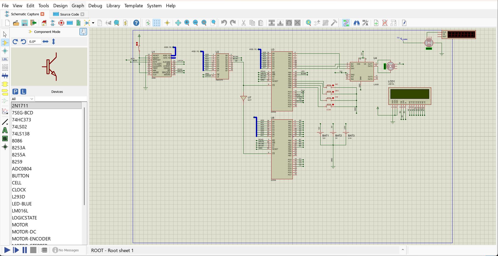

# Intel-8255-Motor-Speed-Interface

> Motor Speed Monitoring and Direction Detection using Intel 8255 Programmable Peripheral Interface (PPI) and 16×2 LCD Display in Proteus


> 🚀 **Completed Academic Project** | 8086 Microprocessor | Peripheral Interfacing | Assembly Programming | Proteus Simulation

---

# Overview

This project demonstrates the design and simulation of an **8086-based DC Motor Speed Monitoring and Direction Control System** using the **Intel 8255 Programmable Peripheral Interface (PPI)**.

Developed as part of the **Computer Design and Applications**, the project integrates an **8086 microprocessor**, **dual Intel 8255 PPIs**, **L293D H-Bridge motor driver**, and a **16×2 LCD** within **Proteus Design Suite** to perform real-time motor control, speed regulation, and direction monitoring.

---

# Features

- Real-time DC motor speed monitoring
- Clockwise and Anti-clockwise motor control
- Signed speed display on a 16×2 LCD
- PWM-based software speed regulation
- Dual Intel 8255 PPI architecture
- I/O-Mapped I/O implementation
- Address decoding using 74HC373
- Complete simulation in Proteus Design Suite

---

# System Components

- Intel 8086 Microprocessor
- Intel 8255A Programmable Peripheral Interface (2×)
- 74HC373 Address Latch
- L293D H-Bridge Motor Driver
- 16×2 LCD Display
- DC Motor
- Push Button Switches
- Proteus Design Suite

---

# System Architecture

The project follows an **I/O-Mapped I/O architecture**, where the **8086** communicates with external peripherals using **IN** and **OUT** instructions.

- **8255 (U3)** controls the DC motor and reads switch inputs.
- **8255 (U6)** interfaces with the 16×2 LCD.
- **74HC373** demultiplexes the multiplexed address/data bus.
- **L293D** provides bidirectional motor driving.
- **LCD** displays signed real-time motor speed and direction.

---

# Working Principle

1. Initialize both Intel 8255 PPIs.
2. Configure the LCD.
3. Continuously poll user input switches.
4. Determine motor direction.
5. Generate PWM through software.
6. Drive the motor using the L293D.
7. Display signed speed on the LCD.
8. Repeat the control loop continuously.

---

# Project Outcomes

- Designed a complete 8086-based motor control architecture.
- Configured Intel 8255 PPI in Mode 0.
- Implemented PWM-based software speed control.
- Controlled clockwise and anti-clockwise motor rotation.
- Displayed real-time signed motor speed on a 16×2 LCD.
- Strengthened understanding of microprocessor interfacing, address decoding, and peripheral communication.

---

# Applications

- Embedded Systems Education
- Microprocessor & Interfacing Laboratories
- Industrial Motor Control Concepts
- Peripheral Interfacing
- Academic Demonstration of I/O-Mapped I/O

---

# Project Structure

```text
Intel-8255-Motor-Speed-Interface
│
├── docs/
├── firmware/
├── report/
└── README.md
```

---

# 📸 Project Demonstration

## Proteus Simulation

A complete software simulation demonstrating:

- Motor speed control
- Clockwise / Anti-clockwise rotation
- PWM-based regulation
- Real-time LCD updates

🎥 **Simulation Video**

[▶️ Watch Proteus Simulation](demo/Proteus_Simulation.mp4)

---

## Circuit Diagram

<p align="center">

</p>

---

# Documentation

Additional project resources are available in:

- 📁 `docs/`
- ⚙️ `firmware/`
- 📄 `report/`

---

# Contributors

- **Dhruvi Singh**
- **Kahaan Padiya**
- **Anurag Tripathi**
